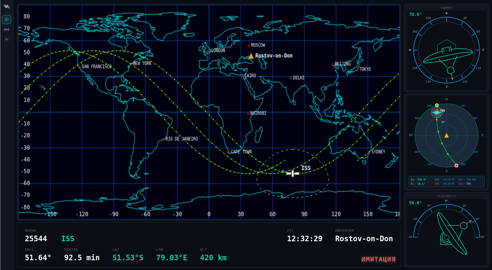

# SatWatch

Кроссплатформенное приложение для отслеживания спутников CubeSat и SDR приёма/демодуляции сигналов.


## Демонстрация интерфейса

### Скриншоты

- **[Главный интерфейс приложения](docs/images/main.png)**  
  Общий вид интерфейса SatWatch с картой мира, индикаторами азимута и угла места, азимутальной проекцией неба и информационной панелью со всеми параметрами спутника.

### Анимация

  
*Анимация работы всех компонентов интерфейса: отображение орбиты спутника на карте, обновление индикаторов в реальном времени, анимация движения спутника и взаимодействие с различными элементами UI.*

## Технологии

**Backend:**
- Go
- REST API + SSE (Server-Sent Events)
- Go templates

**Frontend:**
- HTMX — динамические UI компоненты
- Vanilla JS + Canvas — визуализации (карта, индикаторы)
- CSS Grid — адаптивная вёрстка

## Запуск

```bash
# Сборка
make build

# Запуск
make run

# Открыть в браузере
# http://localhost:8080
```

## Структура проекта

```
├── cmd/server/          # Приложение
├── internal/
│   ├── config/          # Конфигурация
│   └── handlers/        # HTTP handlers
├── static/
│   ├── css/             # Стили
│   ├── js/              # JavaScript (earthview, azimuth, elevation)
│   └── data/            # GeoJSON данные береговых линий
└── templates/           # HTML шаблоны
```

## Лицензия

MIT
