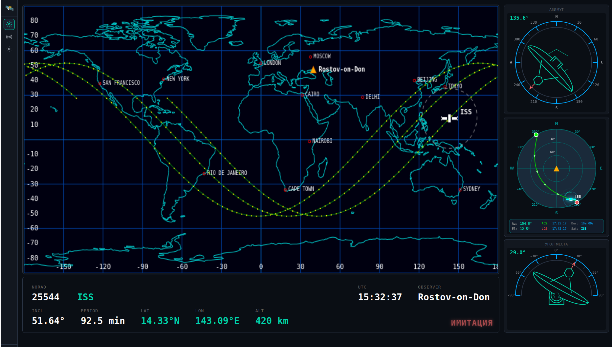

# Satellite Scout

Кроссплатформенное приложение для отслеживания спутников и SDR приёма/демодуляции сигналов.

## Демонстрация интерфейса

### Скриншоты

  
*Общий вид интерфейса Satellite Scout с картой мира, индикаторами азимута и угла места, азимутальной проекцией неба и информационной панелью со всеми параметрами спутника.*

### Анимация

  
*Анимация работы всех компонентов интерфейса: отображение орбиты спутника на карте, обновление индикаторов в реальном времени, анимация движения спутника и взаимодействие с различными элементами UI.*

## Технологии

**Backend:**

- Go
- REST API + SSE (Server-Sent Events)
- Go templates

**Frontend:**

- HTMX — динамические UI компоненты
- Vanilla JS + Canvas — визуализации (карта, индикаторы)
- CSS Grid — адаптивная вёрстка

## Запуск

```bash
# Сборка
make build

# Запуск
make run

# Открыть в браузере
# http://localhost:8080
```

## Ключевой функционал

### Backend

- 🔄 **Загрузка TLE** — автоматическая загрузка орбитальных данных с Celestrak
- 🔄 **SGP4 пропагация** — расчёт позиций спутников с точностью ±0.01°
- ⏳ **Pass Predictor** — расчёт пролётов (AOS/MAX/LOS) с точностью ±30 сек
- ⏳ **Освещённость** — определение Sunlit/Penumbra/Umbra для спутников
- ⏳ **Real-time данные** — SSE обновления позиций каждую секунду

### Frontend

- ⏳ **Earth View** — визуализация орбит на карте мира с ground track
- ⏳ **Sky View** — азимутальная проекция неба для наблюдателя
- ⏳ **Индикаторы** — real-time азимут/угол места
- ⏳ **Таблица пролётов** — предсказание видимых пролётов на 24 часа
- ⏳ **Автопереключение** — смена активного спутника после LOS

### Имитатор (для TDD)

- ⏳ **TLE Generator** — генерация TLE из параметров орбиты
- ⏳ **FSK модулятор** — модуляция телеметрии
- ⏳ **SDR симулятор** — имитация приёма с шумом и Doppler
- ⏳ **FSK демодулятор** — декодирование телеметрии

**Легенда:** ✅ Завершено | 🔄 В работе | ⏳ Запланировано

### 8 фаз разработки

| Фаза | Статус | Описание |
|------|--------|----------|
| **PHASE-1** | 🔄 60% | Загрузка орбитальных данных и расчёт позиций |
| **PHASE-2** | ⏳ 0% | Географические координаты и освещённость |
| **PHASE-3** | ⏳ 0% | Предсказание пролётов над точкой наблюдения |
| **PHASE-4** | ⏳ 0% | Траектории спутников на карте |
| **PHASE-5** | ⏳ 0% | Обновления в реальном времени |
| **PHASE-6** | ⏳ 0% | Интерфейс и визуализация |
| **PHASE-7** | ⏳ 0% | Настройки и управление ошибками |
| **PHASE-8** | ⏳ 0% | Тестирование и проверка точности |

## Статус разработки

```bash
Общий прогресс: █░░░░░░░░░░░░░░░░░░░ 9% (3/35 задач)

✅ Парсер TLE (поддержка Alpha-5 для Starlink)
✅ HTTP клиент Celestrak с rate limiting
✅ Интеграция SGP4
⏳ Координатные преобразования и расчёт пролётов
⏳ Real-time обновления через SSE
⏳ Ground track и footprint визуализация
```

## Лицензия

MIT
